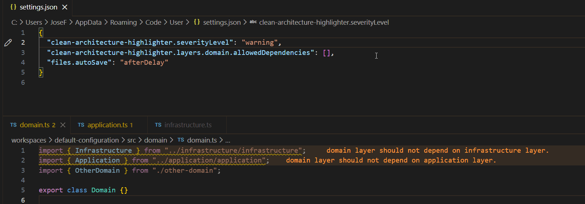
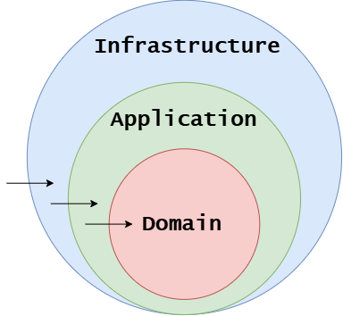

# Clean Architecture Highlighter

[](https://marketplace.visualstudio.com/items?itemName=TODO_PUBLISHER_NAME.clean-architecture-highlighter)
[](https://github.com/jfrz38/clean-architecture-highlighter/actions)

VS Code extension to **enforce Clean Architecture rules** in Node.js projects by **statically analyzing imports**.



## Features

- ⚙️**Configurable layers and dependency rules**  
- ⚡**Real-time diagnostics** on file open / change  
- 🗺️ **Path alias support**  
- 🧅**Default Clean Architecture rules** out of the box  
- 🧩 **Non-intrusive** (no code changes required)

Checks that dependencies between layers follow the configured architecture, by default:

```bash
infrastructure → application → domain
```

If a file imports something from a forbidden layer, the extension shows a **VS Code warning/error**.

## Extension Settings

The extension can be customized via workspace or user settings.
Below is the default configuration, which enforces a standard Clean Architecture layout.

```json
// settings.json
{
    "clean-architecture-highlighter.severityLevel": "warning",
    "clean-architecture-highlighter.sourceFolder": "src",
    
    "clean-architecture-highlighter.layers.domain.aliases": ["domain"],
    "clean-architecture-highlighter.layers.domain.allowedDependencies": ["domain"],

    "clean-architecture-highlighter.layers.application.aliases": ["application"],
    "clean-architecture-highlighter.layers.application.allowedDependencies": ["application", "domain"],

    "clean-architecture-highlighter.layers.infrastructure.aliases": ["infrastructure"],
    "clean-architecture-highlighter.layers.infrastructure.allowedDependencies": ["infrastructure", "application", "domain"]
}
```

| Setting                              | Type     | Default   | Possible values                           | Description                                                                                                    |
| ------------------------------------ | -------- | --------- | ----------------------------------------- | -------------------------------------------------------------------------------------------------------------- |
| `severityLevel`                      | string   | `warning` | `error`, `warning`, `info`                | VS Code diagnostic severity used when a rule is broken                                                         |
| `sourceFolder`                       | string   | `src`     | any folder name                           | Root folder where the source code is analyzed. Only files below this folder (and subfolders) will be analyzed. |
| `layers.<layer>.aliases`             | string[] | —         | any string[]                              | Folder or import aliases identifying the layer                                                                 |
| `layers.<layer>.allowedDependencies` | string[] | —         | `domain`, `application`, `infrastructure` | Layers this layer is allowed to depend on                                                                      |

Note that the default `aliases` and `allowedDependencies` **do not need to be set**; they are applied automatically.  
`aliases` are used when your layer folder has a different name. For example, if your `application` folder is called `business`, you can add it here using:

```json
"clean-architecture-highlighter.layers.application.aliases": ["business"]
```

## Requirements

This extension is designed for Node.js/TypeScript projects using ES Modules (`import`/`export`).

- **Folder Structure**: It assumes a layered architecture (by default under a `src` folder but configurable via `sourceFolder`).

## Known Limitations

- **Import Syntax Only**: Currently, the extension only analyzes static `import` statements. It does **not** support CommonJS `require()` or dynamic `import()`.
- **Static Analysis**: The extension checks path strings. It does not resolve complex runtime dependency injection containers if they are not reflected in the file's import statements.

## The Dependency Rule

The arrows in the diagram below represent the only allowed direction for dependencies.  
Inner layers **must not know anything** about outer layers.


