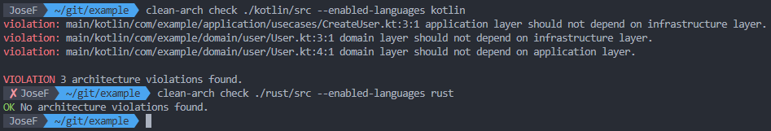
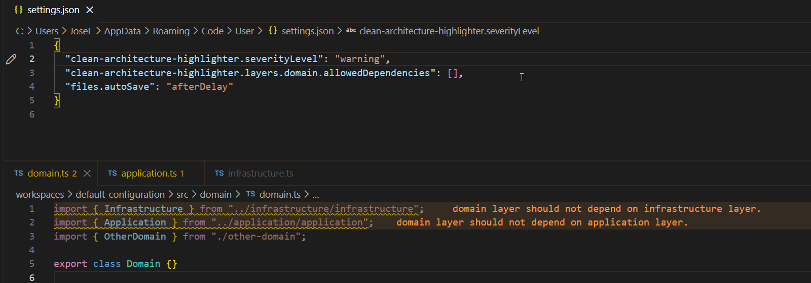

# Clean Architecture Highlighter

[](https://github.com/jfrz38/clean-architecture-highlighter/actions/workflows/build-vscode-extension.yml)
[](https://github.com/jfrz38/clean-architecture-highlighter/actions/workflows/build-cli.yml)
[](https://github.com/jfrz38/clean-architecture-highlighter/actions/workflows/build-github-action.yml)
[](LICENSE)

Clean Architecture Highlighter is a monorepo for checking Clean Architecture dependency boundaries by statically analyzing imports.

The project contains a shared analysis engine in [`packages/core`](packages/core) and user-facing adapters:

| Package | Purpose |
| ------- | ------- |
| 🔗 [`packages/core`](packages/core) | Shared layer configuration, import extraction, dependency analysis, and violation reporting logic. |
| 🔗 [`packages/cli`](packages/cli) | Command-line checker for local scripts and CI pipelines. |
| 🔗 [`packages/github-action`](packages/github-action) | GitHub Action wrapper for pull request checks. |
| 🔗 [`packages/vscode-extension`](packages/vscode-extension) | VS Code extension that reports architecture violations as editor diagnostics. |

Use the **CLI** when you want a repeatable terminal or CI check. Use the **GitHub Action** when you want pull request checks without installing the CLI manually. Use the **VS Code extension** when you want immediate feedback while editing. All adapters use the same core rules.

## Core Idea

The analyzer checks that dependencies between layers follow the configured architecture.

By default, the expected dependency direction is:

```text
infrastructure -> application -> domain
```

That means:

- `domain` can only depend on `domain`.
- `application` can depend on `application` and `domain`.
- `infrastructure` can depend on `infrastructure`, `application`, and `domain`.

If a source file imports something from a forbidden layer, the adapter reports a violation. The CLI prints it and can fail the process; the VS Code extension shows a diagnostic in the editor.

## Quick Start

### CLI

Install the CLI globally:

```bash
pnpm add -g @jfrz38/clean-architecture-highlighter-cli
```

Check a project or source folder:

```bash
clean-arch check .
clean-arch check ./src
```

The package also exposes the long binary name:

```bash
clean-architecture-highlighter check .
```

See the 🔗 [CLI README](packages/cli/README.md) for options, JSON output, exit codes, and CI usage.



### GitHub Action

Run the checker in pull requests:

```yaml
name: Clean Architecture

on:
  pull_request:
    branches:
      - main

jobs:
  clean-architecture:
    runs-on: ubuntu-latest
    steps:
      - name: Checkout repository
        uses: actions/checkout@v6

      - name: Check Clean Architecture boundaries
        uses: jfrz38/clean-architecture-highlighter@v0
        with:
          path: .
          source-folder: src
          enabled-languages: typescript,csharp
```

See the 🔗 [GitHub Action README](packages/github-action/README.md) for inputs, version tags, and configuration examples.

### VS Code Extension

Install the extension from the [Visual Studio Marketplace](https://marketplace.visualstudio.com/items?itemName=jfrz38.clean-architecture-highlighter).

The extension analyzes supported files in the workspace and reports dependency violations as VS Code diagnostics on file open and change.

See the 🔗 [VS Code extension README](packages/vscode-extension/README.md) for marketplace details, settings, and editor behavior.



## Configuration

Both adapters use the same layer model from `packages/core`.

Default configuration:

```json
{
  "enabledLanguages": ["javascript", "typescript"],
  "layers": {
    "domain": {
      "aliases": ["domain"],
      "allowedDependencies": ["domain"]
    },
    "application": {
      "aliases": ["application"],
      "allowedDependencies": ["application", "domain"]
    },
    "infrastructure": {
      "aliases": ["infrastructure"],
      "allowedDependencies": ["infrastructure", "application", "domain"]
    }
  }
}
```

`aliases` identify the folder names or import path fragments that belong to each layer. For example, if your application layer is stored in `business`, configure `business` as an alias for `application`.

Adapter-specific configuration format differs slightly:

- The CLI and GitHub Action read JSON configuration files and command-line-style inputs. See [CLI configuration](packages/cli/README.md#configuration) and [GitHub Action inputs](packages/github-action/README.md#inputs).
- The VS Code extension reads workspace or user settings under the `clean-architecture-highlighter.*` namespace. See [extension settings](packages/vscode-extension/README.md#extension-settings).

## Supported Languages

JavaScript and TypeScript are enabled by default. Other languages are supported as opt-in languages through `enabledLanguages`.

| Language | Identifier | Enabled by default | Supported dependency syntax |
| -------- | ---------- | ------------------ | --------------------------- |
| JavaScript | `javascript` | Yes | Static ES Module `import ... from ...` |
| TypeScript | `typescript` | Yes | Static ES Module `import ... from ...` |
| C# | `csharp` | No | `using ...`, alias directives, static imports, and global usings |
| Dart | `dart` | No | `import ...`, `export ...`, `part ...`, aliases, and `show`/`hide` combinators |
| Elixir | `elixir` | No | `alias ...`, grouped aliases, `import ...`, `require ...`, and `use ...` |
| Go | `go` | No | Single-line imports, import blocks, aliased imports, dot imports, and blank imports |
| Groovy | `groovy` | No | Static `import ...`, `import static ...`, alias imports, and wildcard imports |
| Java | `java` | No | Static `import ...`, `import static ...`, and wildcard imports |
| Kotlin | `kotlin` | No | Static `import ...`, aliased `import ... as ...`, and wildcard imports |
| Lua | `lua` | No | `require(...)`, `require '...'`, and local assignment requires |
| PHP | `php` | No | Namespace `use ...`, aliases, grouped imports, and function/constant imports |
| Python | `python` | No | Static `import ...` and `from ... import ...` |
| Ruby | `ruby` | No | `require ...` and `require_relative ...` |
| Rust | `rust` | No | `use ...`, grouped imports, aliases, glob imports, and `mod ...` declarations |
| Scala | `scala` | No | Static `import ...`, grouped imports, aliases, exclusions, and wildcard imports |

## Known Limitations

For the current analysis limitations, see the 🔗 [core Known Limitations](packages/core/README.md#known-limitations).

## Integration Fixtures

Shared integration fixtures live in [`test/fixtures`](test/fixtures). They validate the same architecture scenarios across adapters and supported languages.

See the 🔗 [fixtures README](test/fixtures/README.md) for scenario organization and test matrix controls.

## The Dependency Rule

The arrows in the diagram below represent the only allowed direction for dependencies. Inner layers must not know anything about outer layers.


